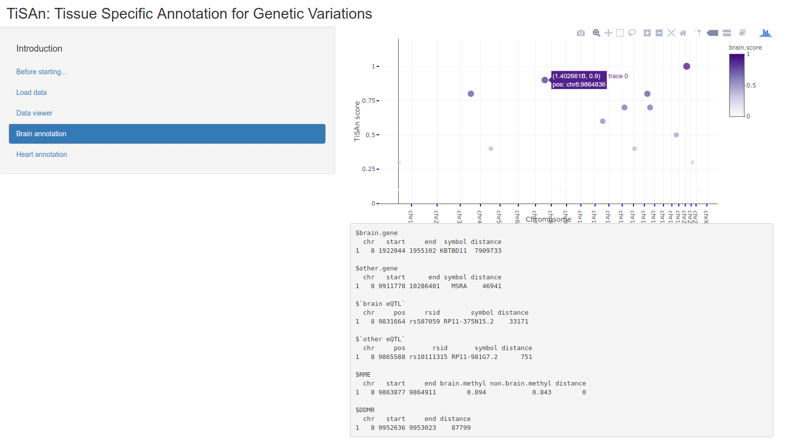

This folder contains elements required to run the Shiny application: TiSAn-view.

Here is a tutorial on how to use TiSAn-view, a companion software for tissue-specific annotations provided by TiSAn predictive method.
It is particularly useful to understand which features were used for a given genomic location to infer the tissue relatedness.
Current version works well for dozens of variants, but will probably run slowly on hundreds.

This graphical user interface (GUI) is powered by Shiny, and so require R to be installed.

Users also need to download TiSAn score databases for both brain and heart tissues (lite version) that could be found at the following address: 
* http://flamingo.psychiatry.uiowa.edu/TiSAn/TiSAn_brain_lite.Rdata
* http://flamingo.psychiatry.uiowa.edu/TiSAn/TiSAn_heart_lite.Rdata

Using the following command line in the repository, where TiSAn-view was downloaded, will open the GUI.

